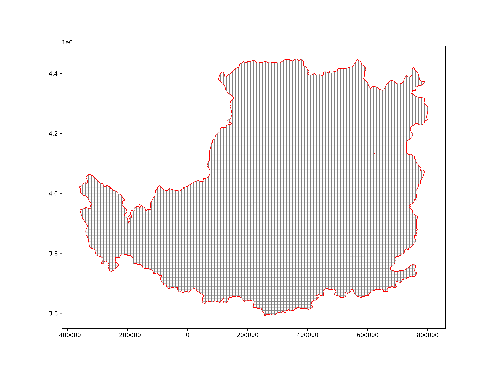
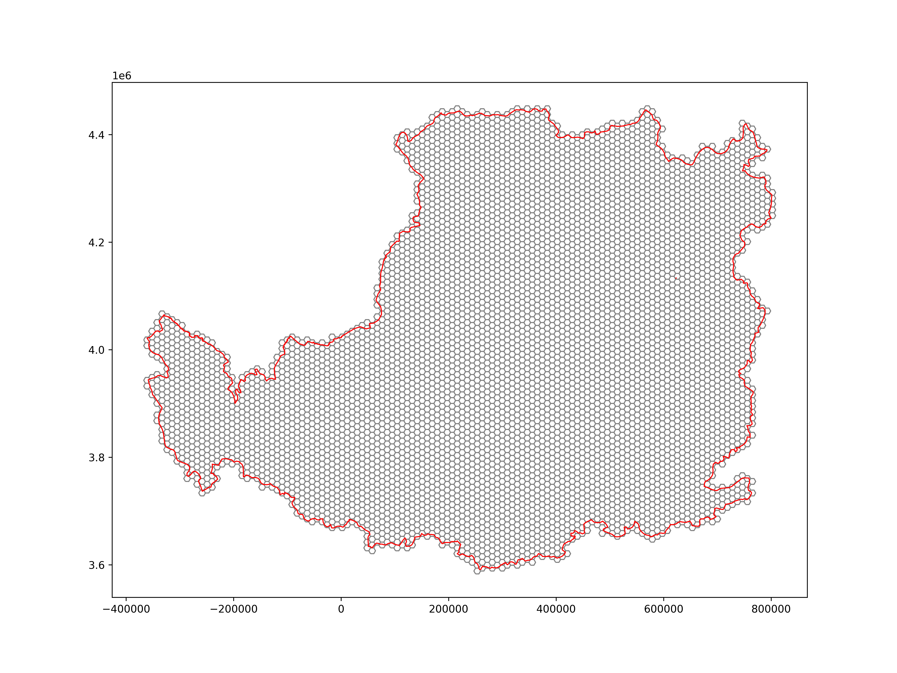

# SpatBox

### A Python Library For GeoSpatial Data Proressing and Modeling！

*Now it only consists of few tools, we will maintain it and add more geospatial-propressing-tools!*

## How to install spatbox in your own PC?

**We recommend to use the conda to install SpatBox**

### First, install the anaconda / miniconda in your own computer.

Go to [anaconda](https://www.anaconda.com/) or [miniconda](https://conda.io/projects/conda/en/latest/user-guide/install/index.html) to 

download the conda; you can also see my zhihu-blog [miniconda安装](https://zhuanlan.zhihu.com/p/585511162)

### Second, create a conda env and install the dependence of SpatBox.

Open the "Anaconda Prompt" and input the code `conda create -n spat-env python=3.9`, then enter,

After that, activate the conda-env you have created, use `conda activate spat-env`, and you will get in the "spat-env" conda-env

Then we install the mamba package to get a rapid installation:

`conda install -c conda-forge mamba` 

(if you are in China, you can use `conda install mamba -c https://mirrors.sustech.edu.cn/anaconda/cloud/conda-forge`)

**The SpatBox Library depends on GDAL；Geopandas;rasterio.....** , all of the dependence are include in pysal's dependence,

you can use `mamba install -c conda-forge pysal` to get all of the spatbox dependence installed.

(if you are in China, you can use `mamba install pysal -c https://mirrors.sustech.edu.cn/anaconda/cloud/conda-forge`)

### Finally, install SpatBox.

Input the code `pip install spatbox` in your "spat-env" conda-env,

(if you are in China, you can use `pip install spatbox -i https://pypi.douban.com/simple`)

## Check Whether the spatbox can work?

Open the `Jupyter Notebook` or `VSCode`, run:

```python
import spatbox as stx
import geopandas as gpd
import matplotlib.pyplot as plt  

lp = gpd.read_file(stx.utils.get_path('lp'))

stx.make_grid(inputfile=stx.utils.get_path('lp'),
              outfile='square',
              gridsize=10000,
              square=True)

lp_square = gpd.read_file('square')
fig, ax = plt.subplots(1,1, figsize=(12,9))
lp_square.plot(ax=ax, fc='w', ec='grey') 
lp.plot(ax=ax, fc='none', ec='r')
plt.savefig('./figure/square.png',dpi=600)
```

<center></center>

```python
stx.make_grid(inputfile=stx.utils.get_path('lp'),
              outfile='honeycomb',
              gridsize=10000,
              square=False)

lp_honeycomb = gpd.read_file('honeycomb')
fig, ax = plt.subplots(1,1, figsize=(12,9))
lp_honeycomb.plot(ax=ax, fc='w', ec='grey') 
lp.plot(ax=ax, fc='none', ec='r')
plt.savefig('./figure/honeycomb.png',dpi=600)
```
<center></center>